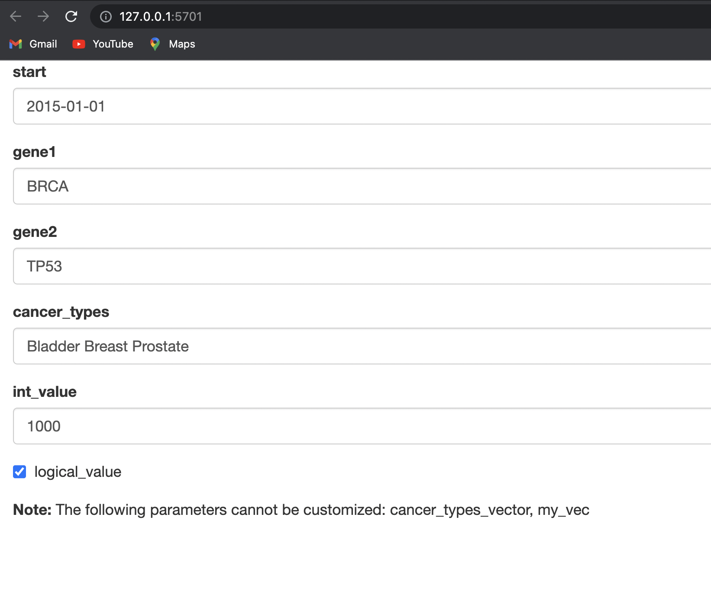

```{r setup, include=FALSE}
knitr::opts_chunk$set(echo = TRUE)
```

## Parameter types

All of the standard R types that can be parsed by the yaml::yaml.load function 
are supported including `character`, `integer`, `numeric`, and `logical`. In addition, 
you can use arbitrary other R object types by specifying the value using an 
R expression. 

Refer to [Parameters](https://rmarkdown.rstudio.com/lesson-6.html)

## Parasing through params

You can refer to things in your chunks with `params$gene1`, call the parameter 
whatever you want, not just `gene1`, but the variable name that makes most
sense for the parameter.

Within the text if you want to call on the first gene: "`r params$gene1`" and 
the second gene: "`r params$gene2`", you can refer to them within your text with 
the back ticks and `r` call. 

Refer to [inline code](https://rmarkdown.rstudio.com/lesson-4.html)

```{r}
(first_gene <- params$gene1)

(second_gene <- params$gene2)
```

### Parsing through a vector in your params

```{r}
(my_cancer_types_character <- params$cancer_types)

class(my_cancer_types_character)

(my_cancer_types_vector <- params$cancer_types_vector)
class(my_cancer_types_vector)
(params$cancer_types_vector[2])

(my_int_value <- params$int_value)

(my_vector <- params$my_vec)

(my_logical_value <- params$logical_value)
```

## Do fancy things with your params


Loop over your parmeters to create great plots, IF your logical value is true

```{r}

if (params$logical_value) {
    message("You will see something amazing!")
    for (cancer in params$cancer_types_vector) {
        print(cancer)
    }
}
```

## Get a free shiny app for setting your params

This is a VERY VERY COOL FEATURE!!

```{r eval=FALSE}
rmarkdown::render("demo.Rmd", params = "ask")
```




## Render outside of your rmarkdown

From outside of your Rmarkdown document you are able to render with different 
parameters than the ones set inside your document, i.e, re-use old Rmarkdowns
and generate for different clients.

```{r eval=FALSE}
renderMyDocument <- function(region, start) {
  rmarkdown::render("MyDocument.Rmd", params = list(
    region = region,
    start = start
  ))
}
```

## Render even more paramters

[Advanced docs](https://garrettgman.github.io/rmarkdown/developer_parameterized_reports.html)
